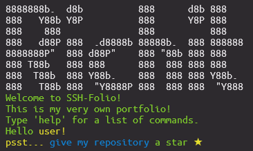
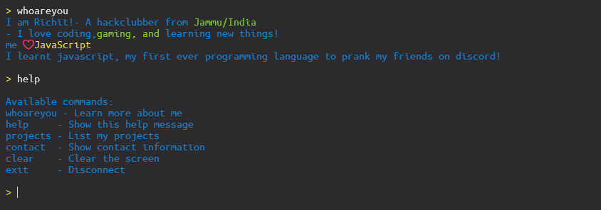

# ssh-folio
<video controls src="assets/banner.mp4" title="Banner"></video>
Everyone makes portfolios, on a website, their githubs, their resumes (?) but i have never seen one make their portfolio on a ssh terminal. 
So i thought, why not make it my self cause, I am definitely not good at frontend.

## How does it work?

Well it uses `ssh2` which can be used to create a custom ssh server which i did and now

The most interesting part is that it only uses only one dependencies, probably because it doesnt have any logic and serves the same as a static website.

## Commands
- help - shows the help menu
- whoareyou - shows who am i? - me not you
- projects - shows some cool projects
- clear    - Clear the screen
- exit     - Disconnect

## Images



## Usage
```
ssh yourname@richit.me -p 2222
```
please replace `yourname` with your nickname/first name, :D